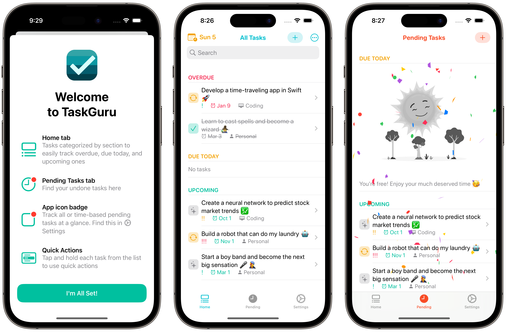

# TaskGuru ✔️

## Context
I developed TaskGuru as the tech lead of my group in the final semester of my iOS Mobile Development course at George Brown College. Within 2 weeks, we defined and completed the main functionalities, and spent the next 3 weeks optimizing the code.

The project required an advanced to-do app with various task types and the ability to create and track them, as well as mark past-due and close-to-due tasks based on the current date/time.

## Screenshots

## App Idea
TaskGuru is a task tracker iOS utility app with the motto of making tracking your todos straightforward yet customizable. The app splits your task list into time-based sections, with badges and context menus to boost your time management. The Settings screen hosts various settings that allow you to customize the app to your needs.

TaskGuru encourages you to complete your pending tasks in a relaxed way. TaskGuru adheres Apple's Human Design Guidelines and is available in multiple languages ✨

Built using SwiftUI with MVVM architecture, TaskGuru utilizes Core Data for persistence. The codebase is idiomatic and reusable, and challenges faced and overcome include app architecture and code structure, separation of concerns, user experience, and, of course, the customizable settings. 

## Concepts Used
<table>
    <thead>
        <tr>
            <th>Technical Concept</th>
            <th>Details</th>
        </tr>
    </thead>
    <tbody>
        <tr>
            <td>Model-View-ViewModel</td>
            <td>The entire app embraces the implementation of MVVM design architecture for better separation of concerns and code maintenance.</td>
        </tr>
        <tr>
            <td>Core Data</td>
            <td>Core Data is an advanced persistence framework that aids the performance and scalability of TaskGuru. An initial choice was UserDefaults, but I realized it was quite limited in terms of storage and wasn't meant to be used for large user data.</td>
        </tr>
        <tr>
            <td>Protocol Oriented</td>
            <td>I built specific modules to be swappable and testable via protocols. At for the scope of TaskGuru, it's the persistence layer.</td>
        </tr>
        <tr>
            <td>Separation of concerns</td>
            <td>In addition to MVVM, supporting modules (persistence, extensions, utilities, etc. are also neatly structured for project readability and maintainability</td>
        </tr>
		<tr>
            <td>Localization</td>
            <td>Support another language beside English for the app. At the moment, Vietnamese, Simplified Chinese and Brazillian Portuguese are fully supported.</td>
        </tr>
		<tr>
            <td>SwiftLint</td>
            <td>Including SwiftLint in TaskGuru codebase helped keeping me in check with Swift coding best practices.</td>
        </tr>
    </tbody>
</table>

## Challenges Overcome
Throughout the development of this project, I encountered several challenges that required innovative solutions. With determination and critical thinking, I was able to overcome them and deliver a robust, functional outcome.

Below are some biggest challenges I faced:
<table>
    <thead>
        <tr>
            <th>Challenge</th>
            <th>Details & How I overcame it</th>
        </tr>
    </thead>
    <tbody>
        <tr>
            <td>Struct or class</td>
            <td>...</td>
        </tr>
        <tr>
            <td>Swift enum to Core Data compatibility</td>
            <td>...</td>
        </tr>
    </tbody>
</table>

## Room for Improvements
There are countless ways to improve a project, regarding code structure, UI, UX, and functionalities, etc. Below are a list of possible improvements I plan to implement in TaskGuru:

* Utilize CloudKit, an advanced framework that allows users to sync data across multiple Apple devices.
* Split the Settings screen into sub-screens to make it clearer which section corresponds to each feature.
* Update the intrinsic logic of the app for notifications, ensuring they are more timely and relevant to the user's needs.
* Support additional information for each task, such as attached files or repeat frequency.

For CloudKit, this will allow users to sync their task data seamlessly across their Apple devices, allowing for a more fluid and connected experience.

Splitting the Settings screen into sub-screens will improve usability, making it easier for users to find and modify specific settings.

Improving the intrinsic logic for notifications will ensure that users are reminded of their tasks at the right time and in the right context, making the app even more helpful for productivity.

Lastly, allowing for the inclusion of more task information will provide users with more options to customize and tailor their tasks to their specific needs.

